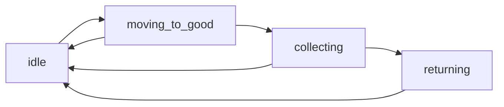

# COMP5005 Warehouse Project Teaching Guide

This guide explains:
- what the assignment asked for
- what we implemented
- where each requirement is in `warehouse.py`
- why each part is written that way
- what each CLI argument means
- a line-by-line walkthrough you can use for viva/demo prep

---

## 1. Quick Answer: "AI residue?"

Current code style is clean and normal student-style:
- short docstrings
- only a couple of practical inline comments
- no over-explained "AI voice" text inside code

You can still personalize names/messages later if you want it even more "you".

---

## 2. What The Assignment Wanted

The assignment specification asks for 7 core code features:

1. Robots as objects with position, state, target, and home corner.
2. Goods representation with availability and nearest-target selection.
3. Pickup-return workflow (`idle -> moving -> collecting -> returning`).
4. Warehouse terrain with shelves as blocked cells and walkable aisles.
5. Two run modes: interactive (`-i`) and batch (`-f`, `-p`).
6. Realtime simulation display using subplots.
7. Realtime + summary statistics.

Also asked for flexibility/usability and clean coding style.

---

## 3. What We Implemented (Feature Mapping)

| Feature | Implemented In `warehouse.py` | What It Does |
|---|---|---|
| 1. Robots | `class Robot` lines 29-120 | Stores robot state and movement logic |
| 2. Goods + targeting | `class Good` lines 18-26, `find_nearest_good` 49-59 | Represents goods and nearest available target selection |
| 3. Workflow | `process_robot_tick` lines 315-380 | Full state machine per robot each tick |
| 4. Terrain | `generate_warehouse` 133-152, `load_warehouse_from_csv` 155-185 | Creates/loads map; shelves block movement |
| 5. UI/CLI modes | `parse_args` 515-538, `validate_args` 541-548, config builders | Supports interactive and batch runs |
| 6. Simulation view | `draw_scene` 392-467 | Map subplot + deliveries chart subplot |
| 7. Statistics | `history` in `run_simulation` 470-490, `print_summary` 493-512 | Realtime deliveries trend + final summary |

---

## 4. CLI Arguments (Exactly What They Mean)

| Argument | Full Name | Type | Meaning |
|---|---|---|---|
| `-i` | `--interactive` | flag | Run with terminal prompts for settings |
| `-f` | `--map-file` | string path | CSV map file for batch mode |
| `-p` | `--params-file` | string path | CSV parameter file for batch mode |

Rules enforced by `validate_args`:
- `-i` must be used alone.
- batch mode must provide both `-f` and `-p`.

Examples:

```bash
python3 warehouse.py -i
python3 warehouse.py -f map1.csv -p params1.csv
```

---

## 5. Input Files Explained

### 5.1 `map1.csv`
Each CSV cell describes terrain:
- shelf: `shelf`, `s`, `1`, `#`
- corner: `corner`, `c`
- anything else -> floor

### 5.2 `params1.csv`
`key,value` rows:
- `robots,6`
- `goods,40`
- `ticks,250`
- `seed,123`
- `pause,0.02`

---

## 6. Visual Understanding

### 6.1 Robot State Flow



Meaning:
- normal cycle is `idle -> moving -> collecting -> returning -> idle`
- fallback edges (`B -> A`, `C -> A`) handle lost/unavailable targets

### 6.2 One Tick Lifecycle

```mermaid
sequenceDiagram
    participant Loop as Tick Loop
    participant R as Robot
    participant G as Goods List
    Loop->>R: process_robot_tick(...)
    alt Robot is idle
        R->>G: find_nearest_good
        R->>G: claim target
    else Robot moving
        R->>R: step_toward target
        R->>R: if adjacent -> collecting
    else Robot collecting
        R->>G: mark good unavailable
        R->>R: carrying=True, state=returning
    else Robot returning
        R->>R: step_toward home
        R->>R: if home -> deliveries += 1, idle
    end
```

---

## 7. Line-by-Line Walkthrough (Teaching Version)

This is written as "line block by line block" so you can learn the code without memorizing 578 separate rows.

## 7.1 File Setup: lines 1-15

| Lines | What Happens | Why |
|---|---|---|
| 1 | module docstring | Gives file identity |
| 3-7 | stdlib imports (`argparse`, `csv`, `math`, `random`, `sys`) | CLI, files, distance, random placement, clean exits |
| 9-10 | matplotlib imports | Needed for realtime subplot visual output |
| 13-15 | `FLOOR`, `SHELF`, `CORNER` constants | Avoids magic strings repeated everywhere |

## 7.2 `Good` class: lines 18-26

| Lines | What Happens | Why |
|---|---|---|
| 18 | class declaration | Creates object type for goods |
| 21 | constructor starts | Initializes one good |
| 23-24 | store coordinates | Shelf location of this item |
| 25 | `available = True` | Good not collected yet |
| 26 | `claimed_by = None` | No robot reserved it yet |

## 7.3 `Robot` class basics: lines 29-47

| Lines | What Happens | Why |
|---|---|---|
| 29 | class declaration | Robot behavior and state live here |
| 32-35 | state constants | Standard finite-state-machine labels |
| 37 | constructor starts | Build one robot instance |
| 39 | `robot_id` | Label and reservation ownership |
| 40-41 | `home_x`, `home_y` | Return location for deliveries |
| 42-43 | `x`, `y` current position | Mutable movement position |
| 44 | starts `IDLE` | Robot waits for first assignment |
| 45 | `target_good = None` | No target at startup |
| 46 | `carrying = False` | Not carrying at startup |
| 47 | `deliveries = 0` | Stats counter per robot |

## 7.4 Target selection: lines 49-59

| Lines | What Happens | Why |
|---|---|---|
| 51-52 | initialize `best_good`, `best_distance` | Track nearest candidate |
| 53 | loop over all goods | Compare every available option |
| 54 | filter available + unclaimed | Prevents double assignment |
| 55 | `math.hypot(...)` | Euclidean distance requirement |
| 56-58 | keep smallest distance | Nearest-target behavior |
| 59 | return chosen good or `None` | Calling code handles both cases |

## 7.5 Reservation: lines 61-66

| Lines | What Happens | Why |
|---|---|---|
| 63 | null-check target | Safety |
| 64 | set `good.claimed_by` | Reservation so others skip it |
| 65 | save reference in robot | Robot knows what it is chasing |
| 66 | state -> moving | Enters active delivery workflow |

## 7.6 Movement validity helper: lines 68-74

| Lines | What Happens | Why |
|---|---|---|
| 70-71 | get grid dimensions | Bounds checking |
| 72-73 | reject outside map | Prevent index errors |
| 74 | reject shelf cells | Enforces obstacle rule |

## 7.7 One-step movement: lines 76-120

| Lines | What Happens | Why |
|---|---|---|
| 78-79 | compute difference to target | Direction source |
| 80-81 | init move deltas | Default no movement |
| 83-91 | derive `move_x`, `move_y` signs | Unit-step movement intent |
| 93-97 | add direct preferred candidates | Try to move toward target first |
| 99-105 | define neighboring fallback cells | Bypass blocked direct path |
| 106-108 | append neighbors not already listed | Candidate pool without duplicates |
| 110-111 | baseline: stay in place distance | Safe fallback if blocked |
| 113-119 | evaluate candidates that are walkable | Choose move that reduces distance |
| 120 | commit selected position | Exactly one-step update per tick |

## 7.8 Corner generator: lines 123-130

Returns four corners:
- `(0,0)`
- `(width-1,0)`
- `(0,height-1)`
- `(width-1,height-1)`

Why:
- assignment says robots initialize at corners only

## 7.9 Procedural terrain: lines 133-152

| Lines | What Happens | Why |
|---|---|---|
| 135-138 | build full floor grid | Start with all walkable |
| 140 | `column_step = aisle_gap + 1` | Controls shelf spacing |
| 141-147 | place vertical shelf columns | Structured shelves + aisles layout |
| 149-150 | force corners to `CORNER` | Guarantees spawn/home walkability |
| 152 | return map | Ready for simulation |

## 7.10 CSV terrain loader: lines 155-185

| Lines | What Happens | Why |
|---|---|---|
| 157 | prepare empty grid | build row by row |
| 158-171 | read and parse each cell token | flexible map encoding |
| 165-170 | map text tokens to constants | robust input handling |
| 173-174 | reject empty file | prevents silent failures |
| 176-179 | enforce equal row lengths | rectangular grid requirement |
| 181-183 | force corners as `CORNER` | consistent spawn rule |
| 185 | return parsed grid | batch-mode map source |

## 7.11 Params loader: lines 188-198

| Lines | What Happens | Why |
|---|---|---|
| 190 | make `params` dict | key/value settings store |
| 191-197 | parse each `key,value` row | configurable batch runs |
| 198 | return dictionary | used by batch config builder |

## 7.12 Safe integer prompt: lines 201-218

| Lines | What Happens | Why |
|---|---|---|
| 203-204 | initialize validation state | loop control without `break` |
| 206 | loop until valid | guided user input |
| 207 | read input | interactive source |
| 208 | digits check | avoids `int()` crash |
| 210-212 | range check and accept | keeps settings sensible |
| 213-216 | print user-friendly errors | usability |
| 218 | return validated integer | reliable downstream config |

## 7.13 Interactive config: lines 221-243

| Lines | What Happens | Why |
|---|---|---|
| 223 | prints mode banner | clarity to user |
| 224-231 | prompt for all core variables | satisfies interactive requirement |
| 233-242 | build config dictionary | unified structure used later |
| 241 | ms to seconds conversion | compatible with `plt.pause` |
| 243 | return config | main pipeline input |

## 7.14 Batch config: lines 246-268

| Lines | What Happens | Why |
|---|---|---|
| 248 | load map from CSV | terrain source for batch |
| 249 | load params from CSV | scenario settings |
| 251-255 | read values with defaults | robust if keys missing |
| 257-267 | build same-style config dict | keeps runtime path consistent |
| 266 | attach `grid` into config | batch already has full map |

## 7.15 Shelf scanning: lines 271-282

| Lines | What Happens | Why |
|---|---|---|
| 273 | output list init | collect shelf coordinates |
| 274-281 | nested loops over grid | inspect every cell |
| 278-279 | store shelf cells only | valid goods locations |
| 282 | return shelf list | used by goods generator |

## 7.16 Goods generation: lines 285-295

| Lines | What Happens | Why |
|---|---|---|
| 287 | get shelf cells | placement candidates |
| 288-289 | fail early if none | avoids impossible simulation |
| 291 | empty goods list | accumulation |
| 292-294 | random shelf choice per item | allows repeated location = multiple goods |
| 295 | return goods list | simulation resource pool |

## 7.17 Robot creation: lines 298-305

| Lines | What Happens | Why |
|---|---|---|
| 300 | get corner list | spawn positions |
| 301 | empty robots list | accumulation |
| 302-304 | create each robot | robot count can exceed 4 via modulo cycling |
| 305 | return robots | used in simulation |

## 7.18 Simple assignment helper: lines 308-312

| Lines | What Happens | Why |
|---|---|---|
| 310 | search nearest available good | local scheduling |
| 311-312 | claim if found | reservation and state update |

## 7.19 Core state machine: lines 315-380

This is the most important function in your demo explanation.

### Case A: robot is `IDLE` (317-318)
- Try assigning a target immediately.

### Case B: robot is `MOVING_TO_GOOD` (320-345)
- read target (321)
- if no target (322-323), reset to idle
- compute `target_taken` (325-331):
  - unavailable OR
  - claimed by another robot
- if taken (332-337):
  - release if needed
  - clear target
  - reset to idle
  - retarget now
- else (338-345):
  - move one step toward good
  - compute Manhattan adjacency (`dx + dy <= 1`)
  - if adjacent, switch to collecting

Why adjacency?  
Goods live on shelf cells, and robots are not allowed to stand on shelf cells.

### Case C: robot is `COLLECTING` (347-372)
- measure adjacency (349-353)
- `can_collect` requires all true (355-360):
  - target exists
  - still available
  - still claimed by this robot
  - still adjacent
- if valid pickup (361-366):
  - mark good unavailable
  - clear claim and target
  - carrying true
  - state returning
- else (367-372):
  - release stale claim if necessary
  - clear target
  - idle for next retarget

### Case D: robot is `RETURNING` (374-380)
- move toward home corner
- once at home:
  - increment deliveries if carrying
  - clear carrying
  - go idle

## 7.20 Count helper: lines 383-389

Counts remaining uncollected goods for summary.

## 7.21 Realtime plotting: lines 392-467

| Lines | What Happens | Why |
|---|---|---|
| 394-400 | convert string grid to numeric matrix | needed for `imshow` |
| 402 | define map color palette | visual clarity |
| 404-410 | draw terrain panel | left subplot map |
| 412-418 | gather available goods positions | only active items shown |
| 419-429 | scatter goods | visible pickup targets |
| 431-444 | gather robots + draw id labels | trace each robot |
| 446-455 | scatter robots | visible movement state |
| 456 | show legend | quick visual key |
| 458-467 | draw deliveries over time line chart | right subplot statistics |

## 7.22 Main simulation loop: lines 470-490

| Lines | What Happens | Why |
|---|---|---|
| 472 | interactive plotting on | realtime updates |
| 473 | build 1x2 subplot figure | assignment subplot requirement |
| 474 | history list init | stats tracking |
| 476-486 | tick loop | fixed-length simulation |
| 478-479 | update each robot once per tick | fair synchronous step |
| 481-482 | compute/store total deliveries | chart metric |
| 483-485 | redraw and pause | realtime animation |
| 488-489 | close interactive mode + show final | clean plot finish |
| 490 | print summary | terminal stats output |

## 7.23 Final text summary: lines 493-512

Prints:
- ticks elapsed
- total deliveries
- remaining goods
- throughput = deliveries / ticks
- per-robot deliveries, state, final position

## 7.24 CLI parser: lines 515-538

Creates CLI options:
- `-i/--interactive` (flag)
- `-f/--map-file` (string)
- `-p/--params-file` (string)

Returns parsed args object.

## 7.25 CLI rule checks: lines 541-548

- If `-i` is present, reject `-f` or `-p`.
- If not interactive, require both `-f` and `-p`.
- Raises `ValueError` with friendly message.

## 7.26 Program entrypoint: lines 551-578

| Lines | What Happens | Why |
|---|---|---|
| 553 | parse args | read run mode |
| 554-558 | validate or exit with error | prevents invalid mode combos |
| 560-567 | build config + grid by selected mode | unified runtime inputs |
| 569 | set random seed | reproducible runs |
| 570-572 | build robot list | simulation actors |
| 573 | build goods list | simulation workload |
| 574 | run simulation | execute full model |
| 577-578 | standard main guard | safe module/script behavior |

---

## 8. Design Choices You Can Explain In Demo

1. Why one file?
- Easier for first-year marking demo.
- Faster navigation during explanation.
- Lower complexity than multi-module structure.

2. Why Euclidean distance?
- Assignment prompt explicitly suggested nearest logic.
- `math.hypot` is clean and readable.

3. Why claims/reservation?
- Prevents two robots selecting same good at same time.

4. Why adjacency collection instead of same-cell collection?
- Shelves are blocked cells.
- Goods are stored on shelves.
- Robot collects from neighboring walkable aisle cell.

5. Why no `while True`, `break`, `continue`, `global`?
- Unit coding guidance strongly discourages those.
- Current code avoids all four cleanly.

---

## 9. How To Run For Your Showcase

Interactive:

```bash
python3 warehouse.py -i
```

Batch (provided files):

```bash
python3 warehouse.py -f map1.csv -p params1.csv
```

---

## 10. Viva Practice Questions (with model answer points)

1. "How do robots avoid shelves?"
- `Robot._is_walkable` checks bounds and rejects shelf cells.
- `step_toward` only selects walkable candidates.

2. "How do you support multiple goods on one shelf?"
- Goods are separate `Good` objects in a list.
- `generate_goods` can choose same shelf multiple times.

3. "What happens if a robot loses its target?"
- In moving/collecting states, if target invalid, robot resets to idle and retargets.

4. "Where are summary stats computed?"
- `print_summary`, using robot delivery totals and remaining goods count.

5. "What makes this flexible?"
- Two run modes.
- CSV-driven maps and parameter values.
- Variable robots/goods/ticks/seed/pause.

---

## 11. Recommended Next Step For Your Report

Use section 3 (feature mapping) as the base of your Traceability Matrix:
- Feature number
- code reference lines
- how you tested
- result (pass/partial/fail)
- completion date

This will save time when writing the report.
