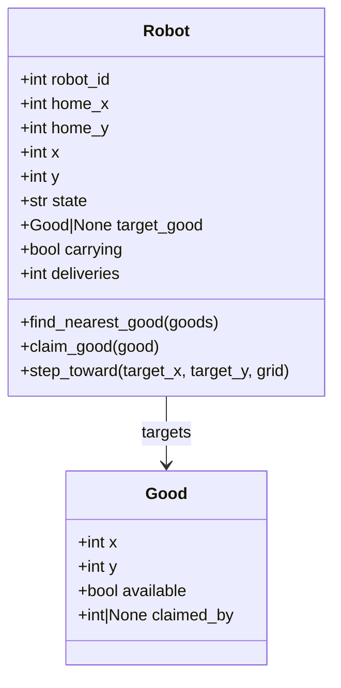

# COMP5005 Fundamentals of Programming

## Robotic Warehouse Simulation Report

Student Name: `<your name>`
Student ID: `<your student id>`
Semester: 1, 2026

---

## 1. Overview

In this assignment I implemented a robotic warehouse simulation in Python. The program models a warehouse as a grid-based environment containing floor cells, shelf cells, and four corner home positions. Robots begin at the corners, select the nearest available good, move toward that shelf while avoiding obstacles, collect one item at a time, and return the item to their home corner.

The final program supports both interactive and batch execution. In interactive mode, the user enters the warehouse size and simulation parameters through prompts. In batch mode, the program reads a terrain file and a parameter file so that multiple scenarios can be reproduced easily. During execution the program displays the warehouse state and a live statistics graph using Matplotlib subplots, and at the end it prints a summary of system performance.

I organised the code into small, focused modules to make the program easier to understand, test, and explain:

1. `warehouse.py` is the entry point.
2. `warehouse_app/models.py` contains the `Robot` and `Good` classes.
3. `warehouse_app/terrain.py` handles map generation, map loading, and good placement.
4. `warehouse_app/config.py` handles command-line arguments and configuration input.
5. `warehouse_app/simulation.py` contains the robot workflow and summary logic.
6. `warehouse_app/visualisation.py` handles plotting.

This structure directly matches the assignment requirements and made the final implementation easier to discuss in terms of objects, terrain, workflow, user interface, and statistics.

---

## 2. User Guide

### 2.1 Requirements

The program requires:

1. Python 3
2. Matplotlib

If Matplotlib is not installed, it can be installed with:

```bash
python3 -m pip install matplotlib
```

### 2.2 Directory Structure

The final submission is organised as follows:

```text
.
├── warehouse.py
├── warehouse_app/
│   ├── config.py
│   ├── constants.py
│   ├── models.py
│   ├── simulation.py
│   ├── terrain.py
│   └── visualisation.py
├── data/
│   ├── map1.csv
│   ├── map2.csv
│   ├── map3.csv
│   ├── params1.csv
│   ├── params2.csv
│   └── params3.csv
└── README.md
```

### 2.3 Interactive Mode

To run the simulation in interactive mode:

```bash
python3 warehouse.py -i
```

The program asks the user to enter:

1. warehouse width
2. warehouse height
3. number of robots
4. number of goods
5. simulation length in ticks
6. aisle gap between shelf columns
7. random seed
8. display pause in milliseconds

### 2.4 Batch Mode

To run the program in batch mode:

```bash
python3 warehouse.py -f data/map1.csv -p data/params1.csv
```

Two additional prepared showcase scenarios are included:

```bash
python3 warehouse.py -f data/map2.csv -p data/params2.csv
python3 warehouse.py -f data/map3.csv -p data/params3.csv
```

### 2.5 Batch File Format

#### Map file

The map file is a CSV grid. Supported values are:

1. `shelf`, `s`, `1`, `#` for shelf cells
2. `corner`, `c` for corner cells
3. any other value for floor cells

#### Parameter file

The parameter file uses `key,value` rows. Supported keys are:

1. `robots`
2. `goods`
3. `ticks`
4. `seed`
5. `pause`

### 2.6 Expected Behaviour

1. Robots spawn only at the four corners.
2. Robots are allowed to overlap with each other.
3. Robots cannot move through shelf cells.
4. Multiple goods may exist at the same shelf location.
5. Each robot attempts to target the nearest available unclaimed good.

---

## 3. Traceability Matrix

| Feature | Code Reference(s) | Test Reference(s) | Test Result | Completion Date |
|---|---|---|---|---|
| 1. Robots are represented as objects that know their position, home corner, state, and target good | `warehouse_app/models.py` lines 19-114, `warehouse_app/simulation.py` lines 10-19 | Scenario runs in batch and interactive mode; robot state changes observed in summaries and simulation behaviour | Pass | 2026-05-18 |
| 2. Goods are represented with location and availability, and multiple goods may exist at one shelf | `warehouse_app/models.py` lines 8-16, `warehouse_app/terrain.py` lines 69-87 | Batch runs with repeated random shelf placement; direct logic checks confirmed multiple goods can be generated at the same shelf | Pass | 2026-05-18 |
| 3. Task allocation and pickup-return workflow are implemented | `warehouse_app/simulation.py` lines 22-93 | Verified through scenario runs and by checking the robot state sequence `idle -> moving_to_good -> collecting -> returning -> idle` | Pass | 2026-05-18 |
| 4. Warehouse terrain contains shelves and walkable aisles, and shelves block movement | `warehouse_app/terrain.py` lines 10-66, `warehouse_app/models.py` lines 60-114 | Reachability checks for all provided maps; scenario runs showed robots successfully navigating around shelves without crossing them | Pass | 2026-05-18 |
| 5. The program provides interactive and batch modes | `warehouse_app/config.py` lines 24-123, `warehouse.py` lines 16-43 | `python3 warehouse.py -i`; `python3 warehouse.py -f data/map1.csv -p data/params1.csv` | Pass | 2026-05-18 |
| 6. The program provides realtime visualisation using subplots | `warehouse_app/visualisation.py` lines 8-75, `warehouse_app/simulation.py` lines 121-148 | Verified during simulation execution using the warehouse map subplot and deliveries-over-time subplot | Pass | 2026-05-18 |
| 7. The program provides realtime and summary statistics | `warehouse_app/visualisation.py` lines 67-75, `warehouse_app/simulation.py` lines 96-118 | Final summaries produced deliveries, remaining goods, throughput, and per-robot results for all showcase scenarios | Pass | 2026-05-18 |

---

## 4. Discussion

### 4.1 Design Approach

My main goal was to produce a simulation that was correct, flexible, and easy to explain. The specification required object-oriented design, a warehouse terrain, task allocation, two user modes, and visual output. To satisfy this cleanly, I separated the solution into modules based on responsibility.

This decision improved the clarity of the program:

1. object definitions are separate from workflow logic
2. terrain generation is separate from input handling
3. visualisation code is separate from simulation state updates
4. the main entry point remains short and easy to follow

This structure is useful in the demonstration because I can explain the system one layer at a time instead of moving through one large file.

### 4.2 Object Model

The simulation uses two main classes:

1. `Good`
2. `Robot`

The `Good` class stores:

1. the shelf coordinates
2. whether the item is still available
3. which robot, if any, has reserved it

The `Robot` class stores:

1. robot ID
2. home corner coordinates
3. current position
4. current state
5. current target good
6. whether it is carrying an item
7. completed delivery count

This object model directly reflects the assignment brief. I chose simple attributes rather than a more complex hierarchy because the assignment mainly rewards clarity and correct behaviour.

### 4.3 Warehouse Terrain

The warehouse is represented as a 2D list. Each cell is marked as:

1. `floor`
2. `shelf`
3. `corner`

This representation works well for both map generation and file input. It is also easy to convert into a plotted form for Matplotlib.

Two terrain approaches are supported:

1. procedural generation in interactive mode
2. CSV loading in batch mode

For the procedural generator, I used vertical shelf columns separated by aisle gaps. The shelves are placed only in the internal rows so that robots can move around the ends of the columns. This creates structured warehouse aisles while keeping the terrain logic simple.

For the batch maps in the `data/` directory, I used accessible layouts so that every shelf location can be reached from the walkable area. This was an important design correction because unreachable shelf cells reduce the validity of a showcase scenario.

### 4.4 Targeting and Reservation

When a robot is idle, it searches the full goods list to find the nearest available unclaimed good. I used Euclidean distance through `math.hypot()` because it gives a simple and consistent nearest-target calculation.

Once a target is selected, the robot reserves it by setting the good's `claimed_by` field. This prevents another robot from choosing the same item at the same time. If the target is no longer valid before pickup, the robot resets and searches again.

I chose this reservation-based approach because it satisfies three assignment needs at the same time:

1. nearest-target selection
2. support for multiple robots
3. correct handling when a target becomes unavailable

### 4.5 Robot Workflow

The central behaviour of the system is the robot state machine in `warehouse_app/simulation.py`. Each robot is always in one of four states:

1. `idle`
2. `moving_to_good`
3. `collecting`
4. `returning`

The workflow is:

1. An idle robot searches for the nearest available good.
2. It moves one step at a time toward that good.
3. Once it reaches a valid adjacent pickup position, it collects the item.
4. It then returns to its original home corner.
5. When it arrives home, the delivery counter increases and the robot becomes idle again.

This design is easy to test and easy to explain because each state has a clear responsibility.

### 4.6 Movement Logic

Robot movement is handled by `step_toward()`. Each tick, the robot attempts to reduce the x or y distance to its target. If the preferred direct move is blocked by a shelf, the robot considers neighboring walkable cells and chooses the move that still improves the remaining distance.

This is a greedy movement strategy rather than a full pathfinding algorithm such as BFS or A*. I selected it because it is sufficient for the structured aisle layouts used in this assignment and keeps the code short enough to defend clearly in a unit demonstration.

The main tradeoff is that this movement strategy is simpler than a general path planner. However, for the supplied scenarios it performs well and demonstrates the required fundamentals of simulation and object-oriented programming.

### 4.7 User Interface and Configuration

The program supports both required execution modes:

1. interactive mode with prompts
2. batch mode with file input

Interactive mode is useful for quick experimentation because the user can change warehouse size, robot count, goods count, simulation time, aisle spacing, and seed directly from the terminal.

Batch mode is useful for reproducible testing and for the report showcase because the same scenario can be run again using the same files and command.

### 4.8 Visualisation and Statistics

The program produces two subplots:

1. a warehouse map
2. a line graph of total deliveries over time

The warehouse map shows:

1. shelves
2. available goods
3. robot positions
4. robot ID labels

The statistics subplot provides a live view of cumulative deliveries. At the end of the simulation, the program also prints summary statistics:

1. ticks elapsed
2. total deliveries
3. remaining goods
4. throughput
5. per-robot deliveries and final states

This combination satisfies the assignment requirement for both realtime and summary statistics.

### 4.9 UML Class Diagram



---

## 5. Showcase

### 5.1 Introduction

To demonstrate the system properly, I prepared three batch-mode scenarios in the `data/` directory. I chose these scenarios to show how changes in warehouse size, robot count, goods count, and simulation length affect system performance.

The scenarios were designed to answer three questions:

1. Can the system fully clear a small workload?
2. What happens when the workload grows faster than the time budget?
3. How does the system perform in a larger warehouse with enough time and capacity?

All showcase runs are reproducible because the commands, input files, and random seeds are fixed.

### 5.2 Scenario 1: Small Accessible Warehouse

Command:

```bash
python3 warehouse.py -f data/map1.csv -p data/params1.csv
```

Configuration:

1. map size: 10 x 8
2. robots: 4
3. goods: 20
4. ticks: 150
5. seed: 123

Output summary:

1. total deliveries: 20
2. remaining goods: 0
3. throughput: 0.133 deliveries/tick

Discussion:

This scenario demonstrates the expected baseline behaviour of the system. The warehouse is small, the shelf layout is fully reachable, and the number of robots is well matched to the number of goods. All goods were collected and returned within the simulation time, which shows that the full target-pickup-return cycle works correctly in a straightforward case.

### 5.3 Scenario 2: Medium Warehouse with Higher Load

Command:

```bash
python3 warehouse.py -f data/map2.csv -p data/params2.csv
```

Configuration:

1. map size: 12 x 9
2. robots: 6
3. goods: 40
4. ticks: 220
5. seed: 456

Output summary:

1. total deliveries: 36
2. remaining goods: 4
3. throughput: 0.164 deliveries/tick

Discussion:

In this scenario the program still performs strongly, but the run ends before every good is delivered. This is not caused by unreachable shelves, because all shelf cells in the map are accessible. Instead, it shows the effect of higher workload and limited simulation time. This makes the scenario useful for comparison because it demonstrates that the system performance depends not only on the robot logic but also on the selected parameters.

### 5.4 Scenario 3: Large Warehouse with Full Completion

Command:

```bash
python3 warehouse.py -f data/map3.csv -p data/params3.csv
```

Configuration:

1. map size: 14 x 10
2. robots: 6
3. goods: 60
4. ticks: 250
5. seed: 321

Output summary:

1. total deliveries: 60
2. remaining goods: 0
3. throughput: 0.240 deliveries/tick

Discussion:

This scenario produced the best overall throughput. The larger warehouse still maintains a clean aisle structure, and the available time is enough for all goods to be collected. Compared with Scenario 1, the system processes more work overall. Compared with Scenario 2, the system benefits from a better balance between map size, workload, and time budget.

### 5.5 Showcase Comparison

The three scenarios show that the simulation responds meaningfully to changing parameters.

Scenario 1 shows that the implementation can fully clear a moderate workload in a compact warehouse.

Scenario 2 shows that when workload increases and time is limited, some goods remain undelivered even though the warehouse layout is fully reachable.

Scenario 3 shows that with a larger warehouse and enough simulation time, the same robot logic can achieve both full completion and higher throughput.

This comparison demonstrates the key assignment idea that changes in parameters and terrain affect the behaviour of the warehouse system.

---

## 6. Conclusion

This assignment required a working warehouse simulation with object-oriented design, terrain constraints, targeting behaviour, two run modes, visual output, and statistics. My final program satisfies these requirements and presents the solution in a structured and explainable way.

The strongest parts of the implementation are:

1. clear object modelling of robots and goods
2. a simple but effective state machine for robot behaviour
3. support for both generated and file-based terrain
4. reproducible showcase scenarios
5. separation of code into logical modules

The most important lesson from the project was that correctness alone is not enough; the quality of the terrain and the organisation of the code also affect how clearly the system can be demonstrated and discussed.

Overall, I believe the final version is a solid and complete implementation of the robotic warehouse specification.

---

## 7. Future Work

Several extensions could be explored in future versions:

1. replace greedy movement with full pathfinding such as BFS or A*
2. add automatic parameter sweep experiments across many scenarios
3. save plots and summary results directly to files
4. add more advanced task allocation strategies, such as balancing robot workload
5. include collision avoidance if robot overlap is no longer allowed
6. add unit tests for the key simulation functions

These changes would improve the sophistication of the simulation, but they were not necessary to meet the required assignment scope.

---

## 8. References

1. Curtin University, *COMP5005 Fundamentals of Programming Semester 1, 2026 Assignment: Robotic Warehouse*.
2. Python Software Foundation, *Python 3 Documentation*.
3. Matplotlib Development Team, *Matplotlib Documentation*.

